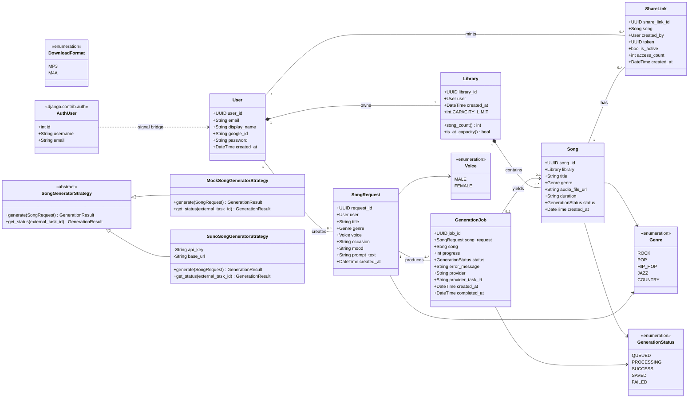
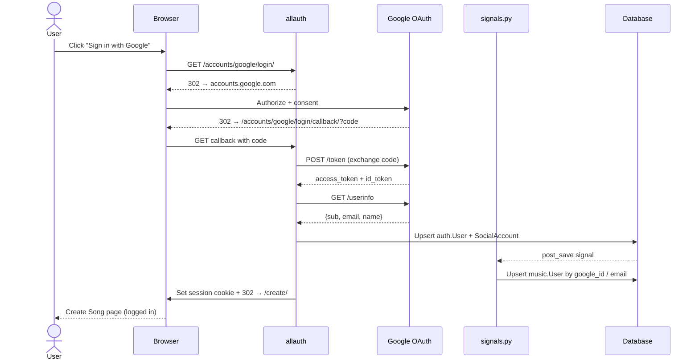
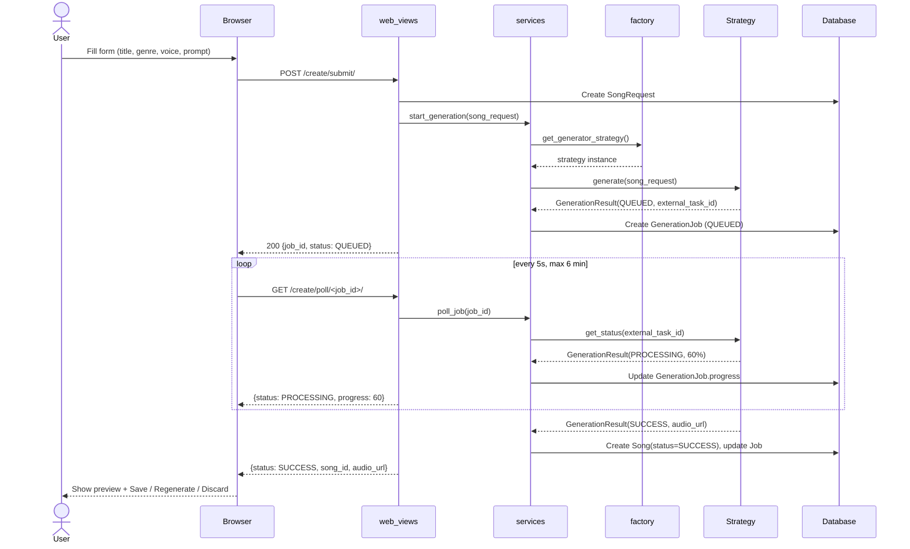
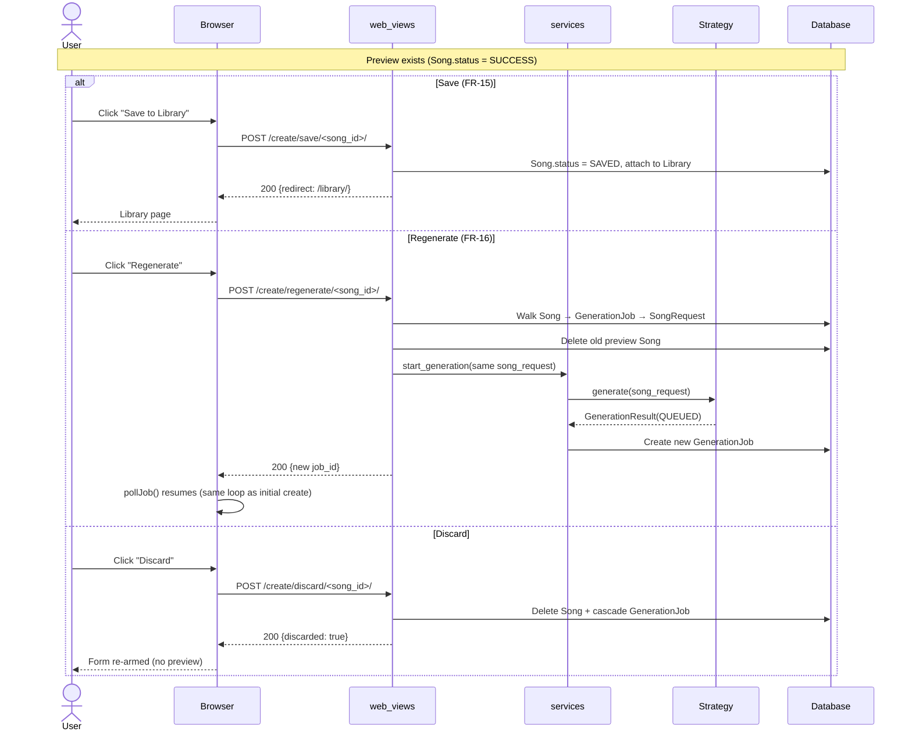
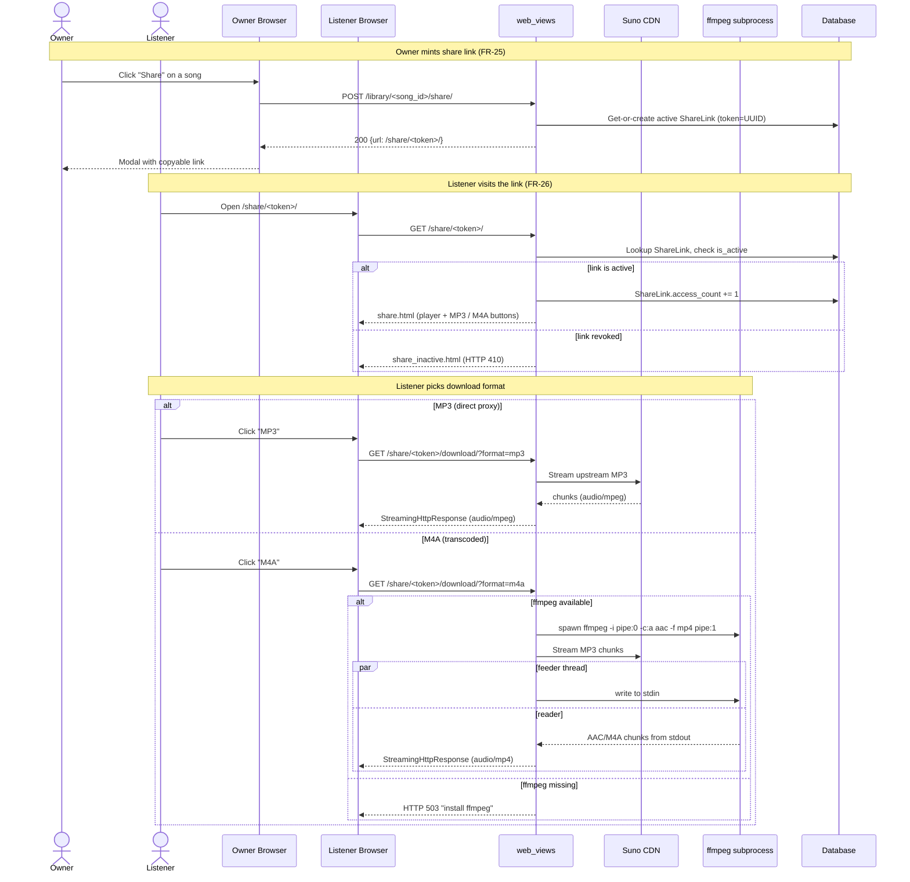

# CITHARA - AI Music Generator

**Exercise 3: Implementing the Domain Layer Using Django**
**Exercise 4: Strategy Pattern for Song Generation (Mock vs Suno API)**
**Exercise 5: Web UI + Google OAuth (SRS FR-01 / FR-02 / §3.1 pages)**

CITHARA is an AI Music Generator web application. This repository contains the domain layer implementation using Django ORM (Exercise 3), the Strategy Pattern for interchangeable song generators (Exercise 4), and a full web UI with Google OAuth login (Exercise 5).

---

## Project Overview

| Item | Detail |
|------|--------|
| **Project** | CITHARA – AI Music Generator |
| **Framework** | Django 6.0 |
| **Database** | SQLite (development) |
| **Python** | 3.x |
| **Author** | Kantee Laibuddee |

---

## Domain Model Summary

### Entities
- **User** – Authenticated person (Creator or Listener)
- **Library** – Personal song collection (1:1 with User)
- **Song** – Generated audio output saved to Library
- **SongRequest** – Captures user intent for song creation
- **GenerationJob** – Tracks AI generation lifecycle
- **ShareLink** – URL token for sharing songs

### Enumerations
- **Genre**: Rock, Pop, Hip-Hop, Jazz, Country
- **Voice**: Male, Female
- **GenerationStatus**: Queued, Processing, Success, Saved, Failed
- **DownloadFormat**: MP3, M4A

### Key Relationships
| From | To | Type | Multiplicity |
|------|----|------|-------------|
| User | Library | Composition (1:1) | 1 : 1 |
| Library | Song | Composition (1:N) | 1 : 0..* |
| User | SongRequest | Association | 1 : 0..* |
| SongRequest | GenerationJob | Association | 1 : 1..* |
| GenerationJob | Song | Dependency | 1 : 0..1 |
| Song | ShareLink | Association | 1 : 0..* |
| User | ShareLink | Dependency | 1 : 0..* |

### Business Rules Enforced
- **BR-02**: Prompt max 1000 characters (validator on `SongRequest.prompt_text`)
- **BR-03**: Single genre from allowed list (choices on `genre` fields)
- **BR-05**: Each user has exactly one library (`OneToOneField`)
- **BR-06**: Library capacity limit of 1,000,000 songs (property check)
- **BR-08**: Deleting a song cascades to remove share links (`on_delete=CASCADE`)

---

## Architecture Diagrams

The following diagrams use [Mermaid](https://mermaid.js.org/) syntax and
render natively on GitHub. They cover the domain model (Exercise 3),
the Strategy hierarchy (Exercise 4), and the four end-to-end flows that
matter most in Exercise 5: OAuth login, song generation with polling,
the Save / Regenerate / Discard preview decision, and public sharing
with MP3 / M4A download.

### Domain Class Diagram (UML)

Entities are the six classes from `music/models/`. Cardinalities follow
the SRS business rules (BR-05 one-library-per-user, BR-06 capacity,
BR-08 cascade). The two enums on the right are the Strategy hierarchy
from Exercise 4. The `auth.User → music.User` dotted arrow is the
signal bridge added in Exercise 5 (`music/signals.py`).



### Sequence: OAuth Login (FR-01)

The Landing page kicks off Google OAuth via `django-allauth`. After
the redirect-and-callback dance, `post_save` on `auth.User` fires the
signal in `music/signals.py`, which upserts the matching `music.User`
row by `google_id` / `email`. This keeps the Exercise 3 domain entity
in sync without coupling it to Django's auth model.



### Sequence: Create Song + Polling (FR-07 → FR-17)

The form POST creates a `SongRequest`, the service layer hands it to
the active `SongGeneratorStrategy` chosen by the factory, and a
`GenerationJob` row is persisted in `QUEUED`. The browser then polls
every 5 seconds (cap 6 minutes) until the job lands in `SUCCESS` or
`FAILED`. On success the strategy returns an `audio_url` and a `Song`
row is created with `status=SUCCESS` — that's the *preview*, not yet
in the library.



### Sequence: Save / Regenerate / Discard (FR-15, FR-16)

After a preview lands the user has three branches. *Save* promotes
`Song.status` from `SUCCESS` to `SAVED` and the song shows up in the
library. *Regenerate* (FR-16) walks the chain
`Song → GenerationJob → SongRequest`, deletes the unwanted preview,
and starts a brand-new job that **reuses the original SongRequest** —
so the user does not have to re-type the form. The same `pollJob()`
JS function takes over again. *Discard* simply cascades the preview
away.



### Sequence: Share + Public Listen + Download (FR-25, FR-26)

The owner mints a `ShareLink` (idempotent — fetches the active one if
it already exists). A public listener visits `/share/<token>/`, and
the view increments `access_count` only when the link is still
`is_active`; otherwise it returns the revoked-link page. Downloads go
through `_build_download_response()`: MP3 is a direct streaming proxy
of Suno's CDN file, while M4A spawns `ffmpeg` as a subprocess and
pipes the upstream MP3 through it on the fly (a background feeder
thread writes to `stdin` while the response reads from `stdout`). If
`ffmpeg` is missing the M4A branch returns HTTP 503.



---

## Setup Instructions

### 1. Clone the Repository
```bash
git clone <repository-url>
cd CITHARA
```

### 2. Install Dependencies
```bash
pip install -r requirements.txt
```
This installs Django plus `requests` (used by the Suno strategy in Exercise 4).

### 3. Apply Migrations
```bash
python manage.py migrate
```

### 4. Create Superuser (for Django Admin)
```bash
python manage.py createsuperuser
```

### 5. Run Development Server
```bash
python manage.py runserver
```

### 6. Access the Application
- **Django Admin**: http://127.0.0.1:8000/admin/
- **API Endpoints**: http://127.0.0.1:8000/api/

---

## CRUD Operations

CRUD operations are available through three methods:

### Method 1: Django Admin Interface
Navigate to `/admin/` to perform Create, Read, Update, and Delete operations on all entities.

### Method 2: API Endpoints (Basic Views)
All entities have REST-style API endpoints under `/api/`:

| Method | Endpoint | Description |
|--------|----------|-------------|
| GET | `/api/users/` | List all users |
| POST | `/api/users/` | Create a new user |
| GET | `/api/users/<user_id>/` | Read a single user |
| PUT | `/api/users/<user_id>/` | Update a user |
| DELETE | `/api/users/<user_id>/` | Delete a user |
| GET | `/api/libraries/` | List all libraries |
| POST | `/api/libraries/` | Create a library |
| GET | `/api/libraries/<library_id>/` | Read a library with songs |
| DELETE | `/api/libraries/<library_id>/` | Delete a library |
| GET | `/api/songs/` | List all songs (filter: `?genre=JAZZ&status=SUCCESS`) |
| POST | `/api/songs/` | Create a new song |
| GET | `/api/songs/<song_id>/` | Read a single song |
| PUT | `/api/songs/<song_id>/` | Update a song |
| DELETE | `/api/songs/<song_id>/` | Delete a song |
| GET | `/api/song-requests/` | List all song requests |
| POST | `/api/song-requests/` | Create a song request |
| GET | `/api/song-requests/<request_id>/` | Read a song request with jobs |
| DELETE | `/api/song-requests/<request_id>/` | Delete a song request |
| GET | `/api/generation-jobs/` | List all generation jobs |
| POST | `/api/generation-jobs/` | Create a generation job |
| GET | `/api/generation-jobs/<job_id>/` | Read a generation job |
| PUT | `/api/generation-jobs/<job_id>/` | Update job status/progress |
| DELETE | `/api/generation-jobs/<job_id>/` | Delete a generation job |
| GET | `/api/share-links/` | List all share links |
| POST | `/api/share-links/` | Create a share link |
| GET | `/api/share-links/<share_link_id>/` | Read a share link |
| PUT | `/api/share-links/<share_link_id>/` | Update (toggle active, increment access) |
| DELETE | `/api/share-links/<share_link_id>/` | Delete a share link |

**Example: Create a user via API**
```bash
curl -X POST http://127.0.0.1:8000/api/users/ \
  -H "Content-Type: application/json" \
  -d '{"email": "test@example.com", "display_name": "Test User"}'
```

### Method 3: CRUD Demo Script
Run the demo script to see all CRUD operations in action via Django ORM:
```bash
python manage.py shell < demo_crud.py
```

---

## Project Structure

```
CITHARA/
├── cithara_project/
│   ├── __init__.py
│   ├── settings.py              # Django settings (SQLite, music app)
│   ├── urls.py                   # URL configuration (admin + API)
│   ├── wsgi.py
│   └── asgi.py
├── music/
│   ├── __init__.py
│   ├── models/                   # Domain entities (separated per class)
│   │   ├── __init__.py           # Exports all models
│   │   ├── enums.py              # Genre, Voice, GenerationStatus, DownloadFormat
│   │   ├── user.py               # User entity
│   │   ├── library.py            # Library entity
│   │   ├── song.py               # Song entity
│   │   ├── song_request.py       # SongRequest entity
│   │   ├── generation_job.py     # GenerationJob entity
│   │   └── share_link.py         # ShareLink entity
│   ├── admin.py                  # Django Admin CRUD configuration
│   ├── apps.py                   # App configuration
│   ├── urls.py                   # API URL routing
│   ├── views.py                  # Basic API views for CRUD
│   └── migrations/
│       ├── __init__.py
│       └── 0001_initial.py       # Initial migration
├── demo_crud.py                  # CRUD operations demo script
├── manage.py
├── screenshots/                  # Evidence of CRUD functionality
└── README.md
```

---

## Evidence of CRUD Functionality

All CRUD operations are demonstrated below via the Django Admin interface.

### CREATE – Adding a New User
Creating a new user with email, display name, and optional authentication fields.


### READ – Viewing All Users
List view showing all users with display name, email, Google ID, and creation timestamp.


### DELETE – Deleting a User
Confirmation page before deleting a user, showing cascade summary of related objects.


### CREATE – Adding a Library
Creating a library for a user (1:1 relationship, BR-05). Shows Song Count and Capacity status (BR-06).


### CREATE – Adding a Song Request
Creating a song request with title, genre, voice, occasion, mood, and prompt text (max 1000 chars, BR-02).


### CREATE – Adding a Song
Creating a song in a user's library with title, genre, audio URL, duration, and status. Includes inline Share Links section.


### CREATE – Adding a Generation Job
Creating a generation job linked to a song request and produced song, with status and progress tracking (0-100%).


### CREATE – Adding a Share Link
Creating a share link with auto-generated unguessable token (NFR-SEC-05), active/inactive toggle for revocation, and access counter.


---

## Exercise 4 — Strategy Pattern (Mock vs Suno API)

Exercise 4 decouples *how* a song is generated from *what* the domain layer does with the result. A single interface — `SongGeneratorStrategy` — defines the contract, and two concrete strategies implement it:

| Strategy | Module | Behaviour |
|----------|--------|-----------|
| **Mock** | `music/generation/mock_strategy.py` | Offline, deterministic. Returns a placeholder audio URL instantly. Used for development, demos, and unit tests. |
| **Suno** | `music/generation/suno_strategy.py` | Calls `https://api.sunoapi.org/api/v1/generate` with a Bearer token, then polls `/generate/record-info` for progress. |

Selecting a strategy is centralised in `music/generation/factory.py` — no `if/elif` branches appear elsewhere in the codebase.

### Package layout

```
music/
├── generation/
│   ├── __init__.py          # Public surface: re-exports interface + factory
│   ├── base.py              # SongGeneratorStrategy (ABC) + data classes
│   ├── mock_strategy.py     # MockSongGeneratorStrategy (offline)
│   ├── suno_strategy.py     # SunoSongGeneratorStrategy (HTTP to sunoapi.org)
│   └── factory.py           # get_generator_strategy() — the ONLY selector
└── services.py              # Domain ↔ strategy bridge (views stay thin)
```

### Switching strategies

All configuration is environment-driven. Copy `.env.example` to `.env` and edit it:

```bash
cp .env.example .env
```

Then set:

```env
# Use the offline mock (default — no credentials required)
GENERATOR_STRATEGY=mock

# …or use the real Suno API
GENERATOR_STRATEGY=suno
SUNO_API_KEY=sk-your-real-key-here
```

Restart `python manage.py runserver`. That is the only change needed to flip providers.

### Where to put the Suno API key (and keeping it secret)

- The key lives **only** in your local `.env` file, which is already listed in `.gitignore`.
- You can also export it in your shell (`export SUNO_API_KEY=...` on macOS/Linux, `setx SUNO_API_KEY "..."` on Windows). Anything in the environment overrides the `.env` file.
- **Never commit the real key.** If you do, rotate it at sunoapi.org immediately.
- The tracked template `.env.example` documents every variable and ships with `SUNO_API_KEY=` blank on purpose.

### New API endpoints

| Method | Endpoint | Description |
|--------|----------|-------------|
| GET | `/api/generator/` | Reports the active strategy + all registered strategies. |
| POST | `/api/generate/` | Body `{"song_request_id": "<uuid>"}` — starts a generation via the configured strategy. Returns the new `GenerationJob`. |
| GET | `/api/generation-jobs/<job_id>/poll/` | Asks the strategy that produced this job for a fresh status (for polling progress). |

Example (mock mode — works fully offline):

```bash
# 1) Create a user, library, and song request first (see Exercise 3 endpoints above).
# 2) Trigger generation
curl -X POST http://127.0.0.1:8000/api/generate/ \
  -H "Content-Type: application/json" \
  -d '{"song_request_id": "00000000-0000-0000-0000-000000000000"}'

# 3) Poll the job (mock finishes instantly; Suno takes a minute or so)
curl http://127.0.0.1:8000/api/generation-jobs/<job_id>/poll/
```

### Running the demonstration script

`demo_strategy.py` exercises the whole flow end-to-end:

```bash
# Mock mode (default — no key needed)
python manage.py shell < demo_strategy.py

# Suno mode (requires SUNO_API_KEY in .env or environment)
GENERATOR_STRATEGY=suno python manage.py shell < demo_strategy.py
```

The script:
1. Prints the active strategy pulled from `settings.GENERATOR_STRATEGY`.
2. Creates a throw-away user + song request.
3. Calls the service layer, which delegates to the strategy via the factory.
4. Polls until the job reaches SUCCESS or FAILED.
5. Invokes the *other* strategy directly to show both implementations satisfy the same contract.

### Design notes

- **Open/Closed.** Adding a third provider (e.g. Udio) is a two-line change: register its factory in `STRATEGY_REGISTRY` and implement `SongGeneratorStrategy`.
- **Single Responsibility.** Strategies know HTTP and request shaping; the service layer knows Django models; the views know only serialization. Nothing crosses those boundaries.
- **Vendor-neutral vocabulary.** Suno's richer status codes (`TEXT_SUCCESS`, `FIRST_SUCCESS`, …) are mapped to a small `StrategyStatus` enum so the domain layer never has to understand them.
- **Secrets hygiene.** The factory reads `SUNO_API_KEY` lazily — tests that exercise only the mock never need the key to be set.

---

## Exercise 5 — Web UI + Google OAuth

Exercise 5 adds the user-facing layer described in the SRS: five pages
(`Landing`, `Login`, `Create Song`, `Library`, `Share`) plus Google
OAuth 2.0 authentication via `django-allauth`.

### Page map (SRS §3.1)

| URL                      | Page         | Auth     | Functional reqs |
|--------------------------|--------------|----------|-----------------|
| `/`                      | Landing      | Public   | FR-01           |
| `/accounts/login/`       | Login        | Public   | FR-01, FR-02    |
| `/create/`               | Create Song  | Required | FR-07 – FR-17   |
| `/library/`              | Library      | Required | FR-18 – FR-24   |
| `/share/<token>/`        | Share        | Public   | FR-25, FR-26    |

### Architecture choices

- **Option A user model.** `music.User` (the domain entity from Exercise 2/3)
  is kept untouched. Google logins authenticate as `django.contrib.auth.User`,
  and a signal bridge in `music/signals.py` upserts the matching `music.User`
  row on every login. This preserves all earlier exercises' evidence.
- **Preview-before-save.** Generation runs in two phases per FR-15:
  the strategy materialises a `Song` row with `status=SUCCESS`, the
  Create Song page shows it as a preview, and the user clicks
  *Save to Library* (`status=SAVED`) or *Discard* (delete).
- **Templates only — no SPA.** Tailwind via CDN, vanilla `fetch()` for
  the Create page's polling loop.
- **UI palette: Midnight Cyan.** The dark theme is built around a
  `cyan-500 → blue-600 → indigo-500` gradient over a deep
  `#082f49 → #0c1a3a → #020617` radial background. CTAs glow with
  `shadow-cyan-500/20`, focus rings use `ring-cyan-500`, and required
  field markers use `text-rose-400`. Semantic colors (emerald for Save,
  red for Delete) are kept intentionally outside the brand gradient.

### One-time Google Cloud Console setup

1. Visit <https://console.cloud.google.com/apis/credentials>.
2. **+ Create Credentials → OAuth client ID → Web application**.
3. **Authorized JavaScript origins** — add both:
   - `http://127.0.0.1:8000`
   - `http://localhost:8000`
4. **Authorized redirect URIs** — add both (mind the trailing slash):
   - `http://127.0.0.1:8000/accounts/google/login/callback/`
   - `http://localhost:8000/accounts/google/login/callback/`
5. Copy the generated **Client ID** and **Client Secret** into your
   local `.env`:
   ```env
   GOOGLE_CLIENT_ID=...apps.googleusercontent.com
   GOOGLE_CLIENT_SECRET=GOCSPX-...
   ```

### Local run

```powershell
# from the CITHARA folder (the one that contains manage.py)
pip install -r requirements.txt
python manage.py migrate
python manage.py createsuperuser     # any email — creates auth.User AND music.User
python manage.py runserver
```

Then open <http://127.0.0.1:8000/> and click *Sign in with Google*.

> ℹ️ **Site domain.** allauth uses the `django.contrib.sites` row with
> `SITE_ID=1`. The default fixture's `example.com` is fine for local
> development because the Google callback path is what matters, not
> the site's display domain. If you ever deploy, update Site #1 in
> `/admin/sites/site/` to your real hostname.

### URL surface added in Exercise 5

| Method | URL | Purpose |
|--------|-----|---------|
| GET    | `/` | Landing page |
| GET    | `/accounts/login/` | Sign-in page (Google button) |
| GET/POST | `/accounts/logout/` | Sign-out |
| GET    | `/accounts/google/login/callback/` | OAuth callback (allauth) |
| GET    | `/create/` | Create Song page |
| POST   | `/create/submit/` | Start a generation (returns job JSON) |
| GET    | `/create/poll/<job_id>/` | Poll job progress |
| POST   | `/create/save/<song_id>/` | Promote preview → Library (FR-15) |
| POST   | `/create/discard/<song_id>/` | Drop preview |
| POST   | `/create/regenerate/<song_id>/` | Regenerate using same SongRequest (FR-16) |
| GET    | `/library/` | Saved songs (filter / sort / search FR-21) |
| POST   | `/library/<song_id>/delete/` | Delete saved song |
| POST   | `/library/<song_id>/share/` | Mint a ShareLink (FR-25) |
| GET    | `/library/<song_id>/download/?format=mp3\|m4a` | Download in chosen format |
| GET    | `/share/<token>/` | Public share page (FR-26 increments counter) |
| GET    | `/share/<token>/download/?format=mp3\|m4a` | Public download in chosen format |

#### MP3 vs M4A download (DownloadFormat enum)

The Library and Share pages expose two download buttons per track —
**MP3** and **M4A** — matching the `DownloadFormat` enum from the SRS.

* **MP3** is a direct streaming proxy of Suno's CDN file. No server-side
  processing required. Always available.
* **M4A** is transcoded on the fly using `ffmpeg` (AAC at 192 kbps in a
  fragmented MP4 container so it streams without seeking). If `ffmpeg`
  is **not** on the server's `PATH`, the M4A button returns HTTP 503
  with a friendly "install ffmpeg" message — pick MP3 in that case.

Install `ffmpeg`:

```bash
# Windows (winget)
winget install Gyan.FFmpeg

# Windows (chocolatey)
choco install ffmpeg

# macOS
brew install ffmpeg

# Debian / Ubuntu
sudo apt install ffmpeg
```

Then restart `python manage.py runserver` so the new binary is picked
up by `shutil.which("ffmpeg")` at module import time.

### Files added / changed

```
templates/
├── base.html                      ← layout + Tailwind + nav
├── account/
│   ├── login.html                 ← override of allauth's login (Google button)
│   └── logout.html                ← override of allauth's logout
└── pages/
    ├── landing.html               ← Page 1
    ├── create_song.html           ← Page 3 (form + preview + JS polling)
    ├── library.html               ← Page 4 (filter / sort / share / delete)
    ├── share.html                 ← Page 5 (public listen)
    └── share_inactive.html        ← revoked-link fallback

music/
├── web_views.py                   ← UI views (separate from REST API)
├── web_urls.py                    ← UI URL routes
└── signals.py                     ← auth.User → music.User bridge

cithara_project/
├── settings.py                    ← + allauth, sites, AUTHENTICATION_BACKENDS
└── urls.py                        ← + /accounts/ + UI routes

music/migrations/
└── 0003_generation_status_saved.py ← adds GenerationStatus.SAVED
```
