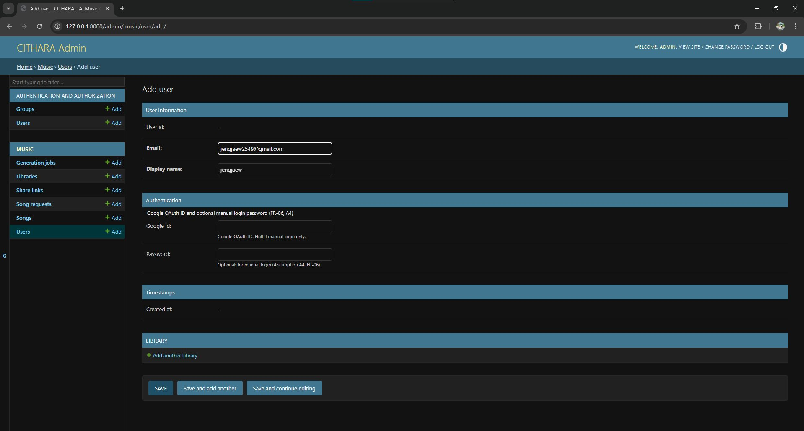
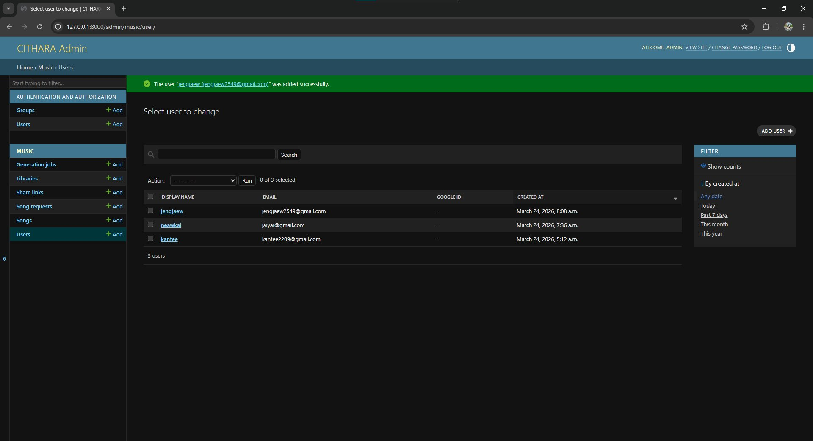
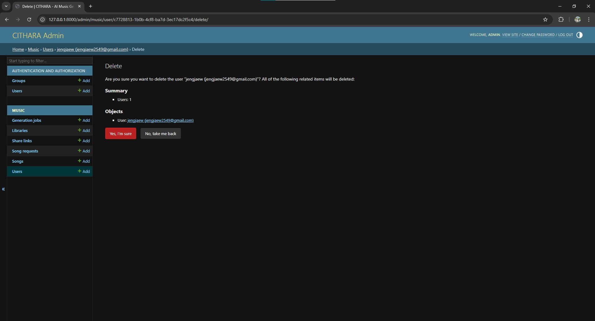
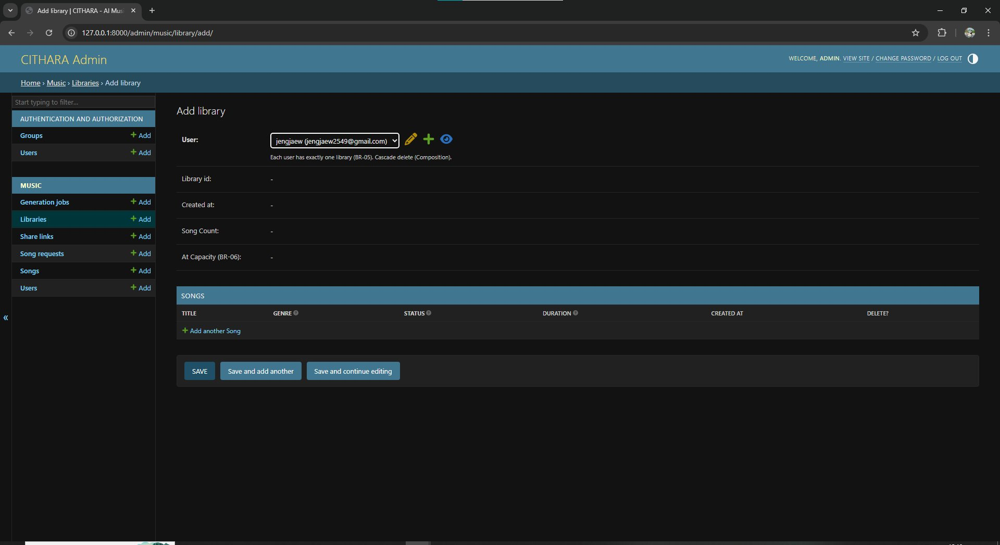
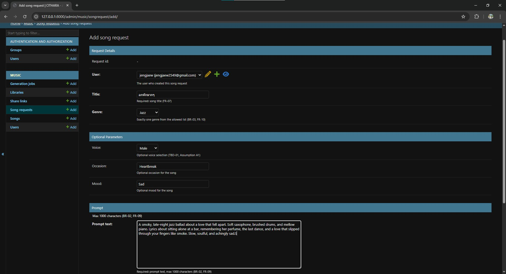
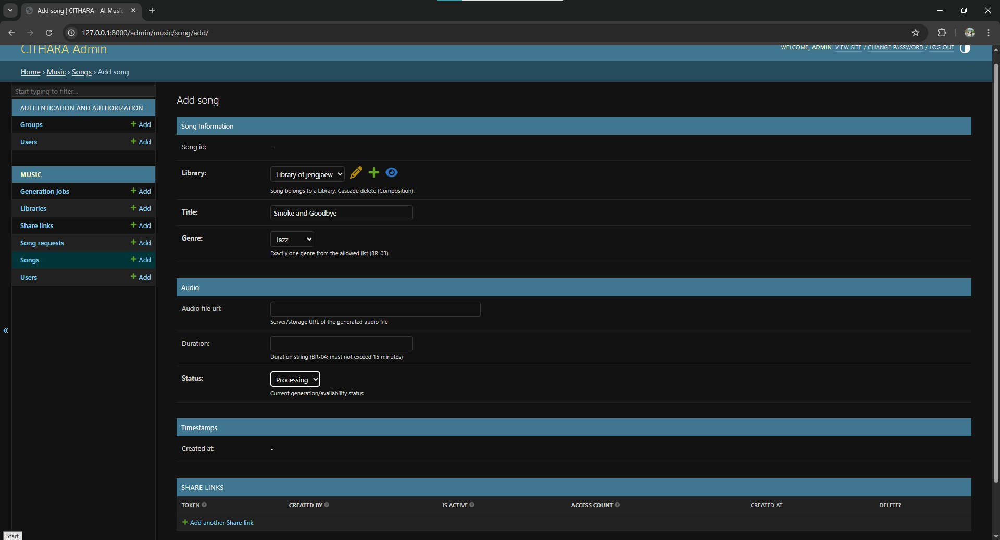
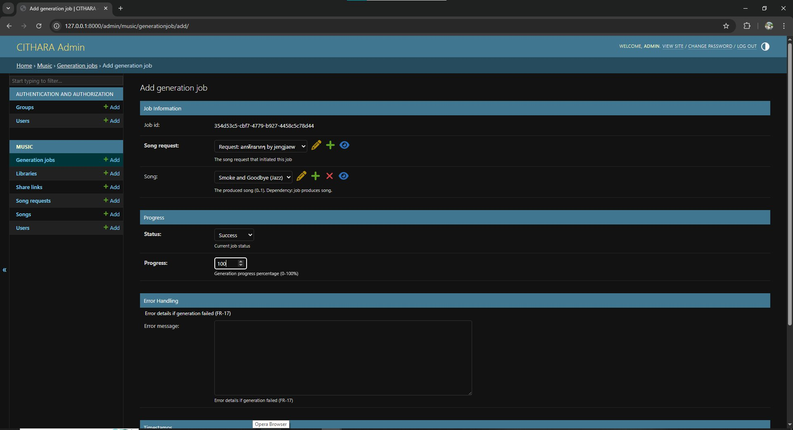
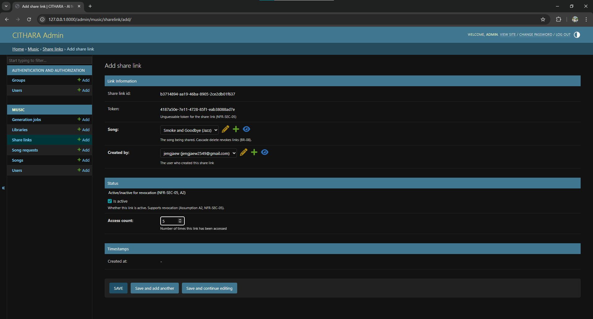

# CITHARA - AI Music Generator (Domain Layer)

**Exercise 3: Implementing the Domain Layer Using Django**

CITHARA is an AI Music Generator web application. This repository contains the domain layer implementation using Django ORM, based on the domain model from Exercise 2.

---

## Project Overview

| Item | Detail |
|------|--------|
| **Project** | CITHARA – AI Music Generator |
| **Framework** | Django 6.0 |
| **Database** | SQLite (development) |
| **Python** | 3.x |
| **Author** | Kantee Laibuddee |

---

## Domain Model Summary

### Entities
- **User** – Authenticated person (Creator or Listener)
- **Library** – Personal song collection (1:1 with User)
- **Song** – Generated audio output saved to Library
- **SongRequest** – Captures user intent for song creation
- **GenerationJob** – Tracks AI generation lifecycle
- **ShareLink** – URL token for sharing songs

### Enumerations
- **Genre**: Rock, Pop, Hip-Hop, Jazz, Country
- **Voice**: Male, Female
- **GenerationStatus**: Queued, Processing, Success, Failed
- **DownloadFormat**: MP3, M4A

### Key Relationships
| From | To | Type | Multiplicity |
|------|----|------|-------------|
| User | Library | Composition (1:1) | 1 : 1 |
| Library | Song | Composition (1:N) | 1 : 0..* |
| User | SongRequest | Association | 1 : 0..* |
| SongRequest | GenerationJob | Association | 1 : 1..* |
| GenerationJob | Song | Dependency | 1 : 0..1 |
| Song | ShareLink | Association | 1 : 0..* |
| User | ShareLink | Dependency | 1 : 0..* |

### Business Rules Enforced
- **BR-02**: Prompt max 1000 characters (validator on `SongRequest.prompt_text`)
- **BR-03**: Single genre from allowed list (choices on `genre` fields)
- **BR-05**: Each user has exactly one library (`OneToOneField`)
- **BR-06**: Library capacity limit of 1,000,000 songs (property check)
- **BR-08**: Deleting a song cascades to remove share links (`on_delete=CASCADE`)

---

## Setup Instructions

### 1. Clone the Repository
```bash
git clone <repository-url>
cd CITHARA
```

### 2. Install Dependencies
```bash
pip install django
```

### 3. Apply Migrations
```bash
python manage.py migrate
```

### 4. Create Superuser (for Django Admin)
```bash
python manage.py createsuperuser
```

### 5. Run Development Server
```bash
python manage.py runserver
```

### 6. Access the Application
- **Django Admin**: http://127.0.0.1:8000/admin/
- **API Endpoints**: http://127.0.0.1:8000/api/

---

## CRUD Operations

CRUD operations are available through three methods:

### Method 1: Django Admin Interface
Navigate to `/admin/` to perform Create, Read, Update, and Delete operations on all entities.

### Method 2: API Endpoints (Basic Views)
All entities have REST-style API endpoints under `/api/`:

| Method | Endpoint | Description |
|--------|----------|-------------|
| GET | `/api/users/` | List all users |
| POST | `/api/users/` | Create a new user |
| GET | `/api/users/<user_id>/` | Read a single user |
| PUT | `/api/users/<user_id>/` | Update a user |
| DELETE | `/api/users/<user_id>/` | Delete a user |
| GET | `/api/libraries/` | List all libraries |
| POST | `/api/libraries/` | Create a library |
| GET | `/api/libraries/<library_id>/` | Read a library with songs |
| DELETE | `/api/libraries/<library_id>/` | Delete a library |
| GET | `/api/songs/` | List all songs (filter: `?genre=JAZZ&status=SUCCESS`) |
| POST | `/api/songs/` | Create a new song |
| GET | `/api/songs/<song_id>/` | Read a single song |
| PUT | `/api/songs/<song_id>/` | Update a song |
| DELETE | `/api/songs/<song_id>/` | Delete a song |
| GET | `/api/song-requests/` | List all song requests |
| POST | `/api/song-requests/` | Create a song request |
| GET | `/api/song-requests/<request_id>/` | Read a song request with jobs |
| DELETE | `/api/song-requests/<request_id>/` | Delete a song request |
| GET | `/api/generation-jobs/` | List all generation jobs |
| POST | `/api/generation-jobs/` | Create a generation job |
| GET | `/api/generation-jobs/<job_id>/` | Read a generation job |
| PUT | `/api/generation-jobs/<job_id>/` | Update job status/progress |
| DELETE | `/api/generation-jobs/<job_id>/` | Delete a generation job |
| GET | `/api/share-links/` | List all share links |
| POST | `/api/share-links/` | Create a share link |
| GET | `/api/share-links/<share_link_id>/` | Read a share link |
| PUT | `/api/share-links/<share_link_id>/` | Update (toggle active, increment access) |
| DELETE | `/api/share-links/<share_link_id>/` | Delete a share link |

**Example: Create a user via API**
```bash
curl -X POST http://127.0.0.1:8000/api/users/ \
  -H "Content-Type: application/json" \
  -d '{"email": "test@example.com", "display_name": "Test User"}'
```

### Method 3: CRUD Demo Script
Run the demo script to see all CRUD operations in action via Django ORM:
```bash
python manage.py shell < demo_crud.py
```

---

## Project Structure

```
CITHARA/
├── cithara_project/
│   ├── __init__.py
│   ├── settings.py              # Django settings (SQLite, music app)
│   ├── urls.py                   # URL configuration (admin + API)
│   ├── wsgi.py
│   └── asgi.py
├── music/
│   ├── __init__.py
│   ├── models/                   # Domain entities (separated per class)
│   │   ├── __init__.py           # Exports all models
│   │   ├── enums.py              # Genre, Voice, GenerationStatus, DownloadFormat
│   │   ├── user.py               # User entity
│   │   ├── library.py            # Library entity
│   │   ├── song.py               # Song entity
│   │   ├── song_request.py       # SongRequest entity
│   │   ├── generation_job.py     # GenerationJob entity
│   │   └── share_link.py         # ShareLink entity
│   ├── admin.py                  # Django Admin CRUD configuration
│   ├── apps.py                   # App configuration
│   ├── urls.py                   # API URL routing
│   ├── views.py                  # Basic API views for CRUD
│   └── migrations/
│       ├── __init__.py
│       └── 0001_initial.py       # Initial migration
├── demo_crud.py                  # CRUD operations demo script
├── manage.py
├── screenshots/                  # Evidence of CRUD functionality
└── README.md
```

---

## Evidence of CRUD Functionality

All CRUD operations are demonstrated below via the Django Admin interface.

### CREATE – Adding a New User
Creating a new user with email, display name, and optional authentication fields.



### READ – Viewing All Users
List view showing all users with display name, email, Google ID, and creation timestamp.



### DELETE – Deleting a User
Confirmation page before deleting a user, showing cascade summary of related objects.



### CREATE – Adding a Library
Creating a library for a user (1:1 relationship, BR-05). Shows Song Count and Capacity status (BR-06).



### CREATE – Adding a Song Request
Creating a song request with title, genre, voice, occasion, mood, and prompt text (max 1000 chars, BR-02).



### CREATE – Adding a Song
Creating a song in a user's library with title, genre, audio URL, duration, and status. Includes inline Share Links section.



### CREATE – Adding a Generation Job
Creating a generation job linked to a song request and produced song, with status and progress tracking (0-100%).



### CREATE – Adding a Share Link
Creating a share link with auto-generated unguessable token (NFR-SEC-05), active/inactive toggle for revocation, and access counter.


